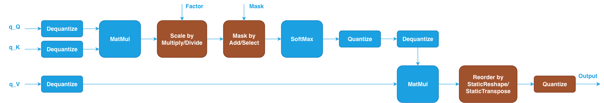

Quantized SDPA {#dev_guide_graph_sdpa_quantized}
================================================

## Overview

Quantized Scaled Dot-Product Attention (SDPA) applies lower precision
technologies to the SDPA pattern to reduce memory bandwidth and improve
computation throughput during inference. In quantized SDPA, the input Query,
Key, and Value tensors are stored in lower precision data types such as
`u8`/`s8` (INT8) or `f8_e4m3`/`f8_e5m2` (FP8) along with scales and zero-points
data. Both INT8 and FP8 quantized SDPA share the same pattern structure,
differing only in the data types used for the quantized tensors. This approach
is commonly used in inference scenarios where reduced precision is acceptable
for improved performance.

The notations used in this topic are:

- N: The mini-batch size.
- H: The number of multi-head.
- S: The sequence length.
- D: The size of each head (head size).

## Quantized SDPA Pattern

The quantized SDPA pattern is defined as a directed acyclic graph (DAG) using
oneDNN Graph API. oneDNN extends the [floating-point SDPA pattern](@ref dev_guide_graph_sdpa)
by inserting Dequantize and Quantize operations around the core SDPA
computations. The supported pattern is as follows. The blue nodes are required
while the brown nodes are optional.

oneDNN Graph API leverages inserting Quantize and Dequantize operations around
floating-point operations to express the corresponding lower precision
computation. Compared to a typical floating-point SDPA pattern, there are a few
differences:

1. Two Dequantize operations are applied to the quantized Query (q_Q) and Key
   (q_K) tensors before the dot products between Query and Key. See
   [Dequantize](@ref dev_guide_op_dequantize) operation in Graph API.
2. After SoftMax, a Quantize operation converts the intermediate `f32`
   probabilities to the quantized type, followed by a Dequantize operation to
   convert back to `f32` for the second MatMul. This Quantize-Dequantize pair
   models the quantization loss between the two MatMul operations. See
   [Quantize](@ref dev_guide_op_quantize) operation in Graph API.
3. A Dequantize operation is applied to the quantized Value (q_V) tensor before
   the second MatMul.
4. A Quantize operation is applied after the second MatMul to produce the final
   quantized output.
5. The Scale and Mask nodes remain optional and follow the same definition
   as in the floating-point SDPA pattern.

### Quantization Attributes

Each Quantize and Dequantize operation requires the following attributes:

- `qtype`: The quantization type. Currently `per_tensor` is supported for
  quantized SDPA.
- `scales`: A vector of scaling factors used for the quantization. It must
  contain single value when `qtype` is set to `per_tensor`.
- `zps`: A vector of zero-points used for the quantization. It is optional and
  can be specified when asymmetric quantization is needed. Once set, it must
  contain a single value when `qtype` is set to `per_tensor`.

## Data Types

oneDNN supports the quantized SDPA pattern with the following quantized data
types for Query, Key, Value, and output. You can specify the data type via the
input and output data type fields of logical tensors for each operation. The
definition of the data types and support status on different CPU and GPU
platforms follow the general description in @ref dev_guide_data_types.

| Query     | Key       | Value     | Dst           |
|:----------|:----------|:----------|:--------------|
| u8        | u8        | u8        | u8 / f32      |
| s8        | s8        | s8        | s8 / f32      |
| f8_e4m3   | f8_e4m3   | f8_e4m3   | f8_e4m3 / f32 |
| f8_e5m2   | f8_e5m2   | f8_e5m2   | f8_e5m2 / f32 |

Notes:
- The intermediate computation is always performed in `f32`.
- All Dequantize outputs and Quantize inputs use `f32` data type.
- The Scale and Mask tensors use `f32` data type.
- The final output can be `f32` by not specifying the last Quantize operation.

## Implementation Limitations

1. Similar to floating-point SDPA, oneDNN primitive-based quantized SDPA is
   implemented as the reference implementation on both Intel Architecture
   Processors and Intel Graphics Products. The quantized SDPA patterns are
   implemented with quantized matmul (with post-ops) and `f32` softmax
   primitives. The reference implementation requires memory to store the
   intermediate results of the dot products between Query and Key which takes
   \f$O(S^2)\f$ memory. It may lead to out-of-memory error when computing long
   sequence length input on platforms with limited memory.
2. The quantized SDPA patterns functionally support all input shapes meeting the
   shape requirements of each operation in the graph.
3. CPU
   - Optimized implementation for inference is available for 4D Q/K tensors with
     shape defined as (N, H, S, D) and V tensor with shape defined as (N, H, S,
     D).
   - Optimized implementation for inference is available for OpenMP runtime and
     Threadpool runtime on Intel Architecture Processors.
   - Specifically for OpenMP runtime, the optimized implementation requires
     `N * H > 2 * thread number` to get enough parallelism.
4. GPU
   - Only primitive-based implementation is provided.

## Example

oneDNN provides a [quantized SDPA example](https://github.com/uxlfoundation/oneDNN/tree/main/examples/graph/sdpa_quantized.cpp)
demonstrating how to construct both INT8 and FP8 quantized SDPA patterns with
oneDNN Graph API on CPU and GPU. The example covers `u8`, `s8`, `f8_e4m3`, and
`f8_e5m2` data types.
