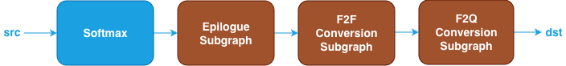

Softmax Fusion Patterns {#dev_guide_graph_softmax_fusion_patterns}
==================================================================

## Overview

oneDNN supports various SoftMax fusion patterns to optimize performance and
reduce memory bandwidth requirements. This document describes the supported
fusion patterns for SoftMax.

## Pattern Structure

oneDNN defines floating-point SoftMax fusion patterns as follows.
The blue nodes are required when defining a SoftMax fusion pattern while the
brown nodes are optional.

1. **SoftMax Operation**: Performs the softmax function for the `src` tensor. See
   the [SoftMax](@ref dev_guide_op_softmax) operation in the Graph API for more
   details.
2. **Epilogue Subgraph**: Optional and can include the following operations:
   - Binary and Unary operations: refer to the Note in
     [Fusion Patterns](graph_fusion_patterns.html).

   

   - N=20, 0 to 20 Binary or Unary operations are supported in the epilogue
     subgraph.
3. **F2F Conversion Subgraph**: Converts the output tensor from floating-point
   to another floating-point. It is constructed by a [TypeCast](@ref dev_guide_op_typecast)
   operation.

   

4. **F2Q Conversion Subgraph**: Converts the output tensor from floating-point
   to quantized data type. It is constructed by a [Quantize](@ref dev_guide_op_quantize)
   operations in Graph API.

   

5. If multiple optional subgraphs are present, they must follow the order
   defined in the pattern structure.

## Data Types

Refer to the document of each operation for the supported data types.

If any optional subgraph is present, the output data type of `SoftMax` must be
`f32`. With that, the F2F conversion subgraph converts the output from `f32` to
`f16` or `bf16` and the F2Q conversion sugraph quantizes the output from `f32`
to `int8`.

The definition of data types and their support status on different CPU and GPU
platforms follow the general description in the [Data Types Guide](@ref dev_guide_data_types).
